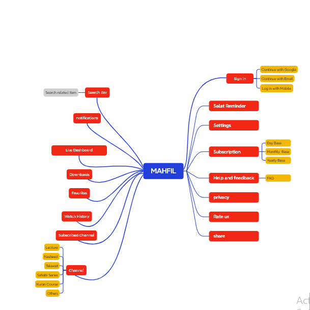

# Mahfil

**Mahfil** is a social media marketing platform aimed at fostering community engagement, content sharing, and personal connections. It enables users to build networks, participate in discussions, and create and share content easily. Mahfil brings people together in a digital community space where they can share ideas, connect with like-minded individuals, and engage with various social and marketing tools.

## Key Features

- **User Profiles**: Set up and personalize your user profile to represent yourself in the community.
- **Community Interaction**: Share posts, comments, likes, and engage with others in real time.
- **Event Creation**: Organize, promote, and participate in community events.
- **Direct Messaging**: Connect with friends and community members through secure, private messaging.
- **Content Sharing**: Post and share multimedia content, including images, videos, and links.
- **Notifications**: Stay updated with real-time notifications on new posts, comments, messages, and other interactions.
- **Analytics and Insights**: For business users, access data insights to improve content reach and engagement.
## Assignment Task

### 1. Manual Testing
[Mahfil](https://www.mahfil.net/) 

### 2. Writing Test Cases
[MAHFIL App test case & Bug Report](https://github.com/prothoma-bd/mahfil-app-assignment/blob/main/MAHFIL%20APP%20test-case%20%26%20Bug%20Rport.xlsx)

### 3. Mind Mapping 

